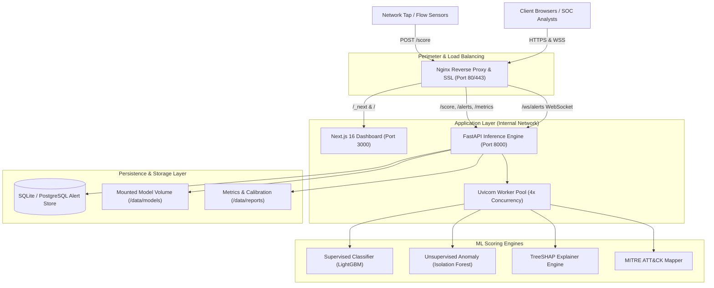

# ==============================================================================
# NetWatch AI SOC — Production Architecture & Topology
# ==============================================================================

This document describes the high-availability topology, data flows, and infrastructure components of NetWatch in production.

---

## 1. High-Level Architecture Diagram

---

## 2. Component Directory

| Component | Technology | Role in Production | Concurrency / Scaling |
|:---|:---|:---|:---|
| **Reverse Proxy** | Nginx 1.25 Alpine | SSL termination, HTTP/2, WebSocket multiplexing, rate-limiting | Multi-worker epoll event loop |
| **Backend API** | FastAPI + Python 3.11 | ML inference, drift tracking, alert persistence, WS broadcasting | 4x Uvicorn worker processes |
| **SOC Dashboard** | Next.js 16 + React 18 | Interactive SOC triage, 3D visualization, MITRE telemetry | Node.js cluster / multi-instance |
| **Supervised Classifier** | LightGBM | Multiclass attack family identification with calibrated probabilities | CPU OpenMP thread-parallel |
| **Anomaly Detector** | Isolation Forest | Unsupervised novel attack detection against benign envelope | Pre-fitted tree estimators |
| **Explainability** | TreeSHAP | Feature attribution values for top contributing flow features | TreePath caching |
| **Database** | SQLite / PostgreSQL | Alert history, analyst triage labels, escalation tracking | Connection pooling with WAL mode |

---

## 3. Data Flow: Flow Ingestion to Live SOC Alert

1. **Ingestion**: Network sensors emit batches of flow dictionaries to `POST /score`.
2. **Feature Preparation**: Features are aligned against the trained 30-feature schema; non-feature identifiers (`Flow ID`, IP addresses) are safely stripped.
3. **Dual-Engine Evaluation**:
   - LightGBM predicts attack family probability distribution.
   - Isolation Forest computes normalized anomaly score.
4. **Decision Boundary**: The combined scorer evaluates whether the flow exceeds the budget threshold (e.g., $\le 50$ false alerts per 10k flows).
5. **Enrichment**:
   - Alerts generate TreeSHAP explanations.
   - Attributed features map to MITRE ATT&CK techniques and recommended actions.
6. **Persistence & Broadcast**:
   - The alert is committed to `netwatch.db`.
   - The alert payload broadcasts via WebSocket `/ws/alerts` to connected analyst consoles in $< 15\text{ms}$.
