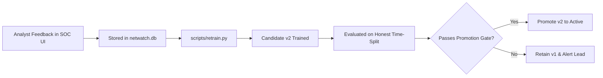

# ==============================================================================
# NetWatch AI SOC — Production Operational Runbook
# ==============================================================================

This runbook guides site reliability engineers (SREs) and SOC platform engineers through routine maintenance, incident response, troubleshooting, and model retraining in production environments.

---

## 1. Quick Emergency Commands

### Inspect Service Status & Logs
```bash
# Docker Compose production stack
docker compose -f docker-compose.yml ps
docker compose -f docker-compose.yml logs -f --tail=100 api
docker compose -f docker-compose.yml logs -f --tail=100 dashboard

# Kubernetes cluster
kubectl get pods,svc,ingress -n netwatch
kubectl logs -f deployment/netwatch-api -n netwatch --tail=100
kubectl logs -f deployment/netwatch-dashboard -n netwatch --tail=100
```

### Restart Failing Services
```bash
# Docker Compose
docker compose -f docker-compose.yml restart api
docker compose -f docker-compose.yml restart dashboard

# Kubernetes
kubectl rollout restart deployment/netwatch-api -n netwatch
kubectl rollout restart deployment/netwatch-dashboard -n netwatch
```

---

## 2. Common Production Incidents & Remediation

### Incident A: API Returns HTTP 503 "Models Not Found"
* **Symptoms**: `/score`, `/models`, or `/metrics/drift` returns `503 Service Unavailable`.
* **Root Cause**: The active model bundle (`models/<ACTIVE>/`: `classifier.joblib`, `anomaly.joblib`, `novelty.joblib`, `thresholds.json`, `reference_stats.json`) is missing or corrupted. The API mounts `models/` from the repository.
* **Resolution**:
  1. Check if model files exist:
     ```bash
     cat models/ACTIVE 2>/dev/null || echo v1   # the version being served
     ls -la models/v1/
     ```
  2. If missing, restore from the latest backup or re-run evaluation:
     ```bash
     bash deployment/scripts/backup.sh  # check available backups
     # Or regenerate models:
     python -m ml.train
     python -m ml.evaluate.model_card
     ```
  3. Restart the API container to re-trigger the warm-up lifespan:
     ```bash
     docker compose -f docker-compose.yml restart api
     ```

### Incident B: False Alert Rate Spikes (> 50 / 10k Flows)
* **Symptoms**: Dashboard banner turns amber/red; alert rail flooded with Benign traffic labeled as attacks.
* **Diagnosis**:
  1. Query active drift metrics:
     ```bash
     curl -s "${PUBLIC_URL}/api/metrics/drift" | jq .
     ```
  2. Inspect whether a network topology shift or new benign software is generating unfamiliar feature distributions.
* **Resolution**:
  1. Review analyst triage labels in SQLite:
     ```bash
     # the alert store is in the netwatch-db-data volume, not ./netwatch.db
     docker compose -f docker-compose.yml --env-file deployment/.env.production exec -T api python -c "import sqlite3; print(sqlite3.connect('/data/db/netwatch.db').execute('SELECT status, analyst_label, COUNT(*) FROM alerts GROUP BY 1, 2').fetchall())"
     ```
  2. Retrain with the analyst labels (section 3), and promote only if the check passes: macro-F1
     improves and false alerts stay within the budget.

### Incident C: WebSocket Disconnections on Live Alert Rail
* **Symptoms**: Dashboard shows "Disconnected" dot; live alerts do not stream until page reload.
* **Diagnosis**:
  - Check Nginx proxy error log for `closed connection while reading upstream` or `WebSocket handshake failed`.
* **Resolution**:
  - Ensure Nginx has proper upgrade headers configured in `nginx.conf`:
    ```nginx
    proxy_set_header Upgrade $http_upgrade;
    proxy_set_header Connection $connection_upgrade;
    proxy_read_timeout 86400s;
    ```
  - Verify container health: `bash deployment/scripts/healthcheck.sh "${PUBLIC_URL}"`.
  - The dashboard connects to `<PUBLIC_URL>/api/ws/alerts`; nginx routes `/api/ws/` with the upgrade headers (`nginx/netwatch-locations.conf`).

---

## 3. Production Model Retraining Workflow

NetWatch is designed so that human analyst triage continuously informs future model generations.



### Retraining Execution Procedure
1. Create a pre-retraining snapshot:
   ```bash
   bash deployment/scripts/backup.sh
   ```
2. Run the retraining pipeline. It reads the analyst labels from an alert store, so point
   `NETWATCH_DB` at the copy of the production store that `backup.sh` made:
   ```bash
   NETWATCH_DB=/path/to/netwatch.db python scripts/retrain.py --out models/v2
   ```
   It prints the promotion check against the version being served: DO NOT PROMOTE, or RECOMMEND PROMOTE.
3. If recommended and approved, promote and restart the API:
   ```bash
   python scripts/promote.py v2        # re-checks, then points models/ACTIVE at v2; v1 is kept
   docker compose -f docker-compose.yml --env-file deployment/.env.production restart api
   ```
4. To go back: `python scripts/promote.py v1 --rollback`, then restart the API.

---

## 4. Routine Maintenance Checklist

| Frequency | Task | Command / Action |
|:---|:---|:---|
| **Daily** | Verify health check status | `bash deployment/scripts/healthcheck.sh` |
| **Daily** | Automated database backup | Crontab running `deployment/scripts/backup.sh` |
| **Weekly** | Review drift & KS statistics | Check `/metrics/drift` and Grafana dashboard |
| **Monthly** | Prune stale alerts older than 90 days | `sqlite3 netwatch.db "DELETE FROM alerts WHERE timestamp < date('now', '-90 days');"` |
| **Quarterly** | Security scans & base image updates | `docker buildx build --no-cache ...` |
